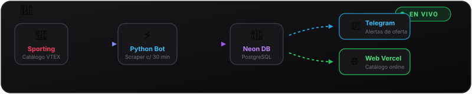

<div align="center">

  

  # 🐾 Llantita

  **Monitor de precios, alertas por Telegram y catálogo web en vivo**

  [](https://llantita-bot.vercel.app/)
  [](https://t.me/llantita_bot)
  [](https://github.com/SoySid/llantita-bot)

  <br />

  ```text
       /\_/\  
      ( o.o )  👟 🐾 "¡Che, mirá que bajó de precio!"
       > ^ <
  ```

</div>

---

## Plataforma web

El catálogo se puede consultar en tiempo real, con filtros por marca y variaciones históricas de precio:

[llantita-bot.vercel.app](https://llantita-bot.vercel.app/)

---

## Flujo del sistema

<p align="center">
  
</p>

1. **Scraper VTEX (`llantita_bot.py`):** consulta periódicamente el catálogo de zapatillas en Sporting Argentina mediante GitHub Actions.
2. **Base de datos (Neon PostgreSQL):** almacena catálogo, talles con stock disponible, imágenes del CDN e historial de precios.
3. **Alertas en Telegram:** notifica a los usuarios suscritos en [@llantita_bot](https://t.me/llantita_bot) ante bajas de precio con stock activo.
4. **Catálogo web en Vercel:** interfaz interactiva desarrollada en Next.js 15 para consultar todo el inventario registrado.

---

## Características de la web

- Vitrina y carrusel de calzado: visualización destacada de ofertas con encuadre proporcional y estilo deportivo.
- Filtro unificado de marcas: selector en carril horizontal con marcas principales (Nike, Adidas, Jordan, Puma, New Balance, Asics, Vans, Fila, Under Armour, Topper).
- Búsqueda en tiempo real: filtrado instantáneo por modelo o término clave.
- Control segmentado de rebajas: ordenamiento por mayor descuento, menor precio o mayor precio.
- Selector de talles con stock: discriminación de modelos con stock confirmado.
- Historial de precios: ventana modal con gráfico SVG que muestra las variaciones de precio en el tiempo según cada talle.
- Modo móvil adaptado: barra de acción inferior fija para facilitar la navegación y filtros al alcance del pulgar.
- Enlace directo a tienda: acceso directo a la publicación oficial en Sporting para concretar la compra.

---

## Comandos en Telegram

Interacción con el bot [@llantita_bot](https://t.me/llantita_bot):

- `/start`: Activa la suscripción para recibir notificaciones automáticas cuando baja un precio con stock disponible.
- `/stop` o `/desuscribir`: Pausa el envío de alertas.

---

## Tecnologías

- Scraper y Bot: Python 3.11, `aiohttp`, `requests`, `psycopg2`
- Frontend Web: Next.js 15 (App Router), React 19, TypeScript, Tailwind CSS, Lucide Icons, `@neondatabase/serverless`
- Base de datos: Neon PostgreSQL
- Despliegue e infraestructura: Vercel (plataforma web) y GitHub Actions (ejecución periódica programada)

---

<div align="center">
  Desarrollado por <strong><a href="https://github.com/SoySid">Alfredo López (@SoySid)</a></strong> · <a href="https://github.com/SoySid/llantita-bot">github.com/SoySid/llantita-bot</a>
</div>
